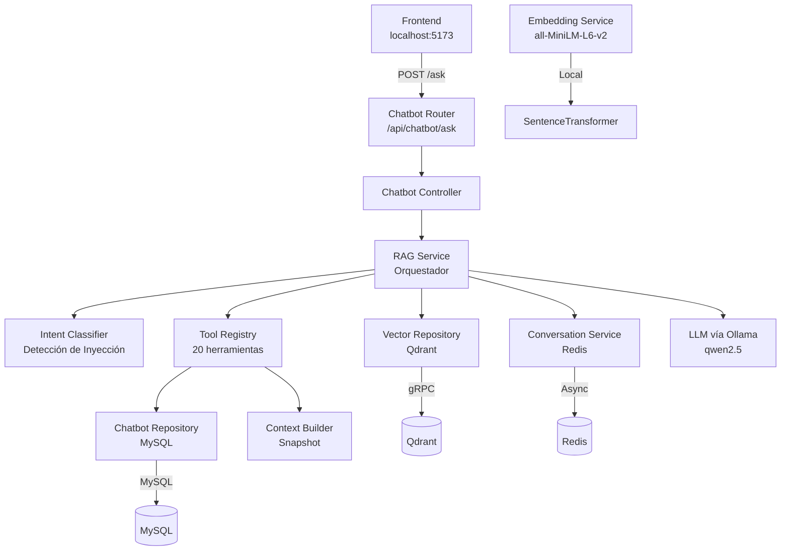
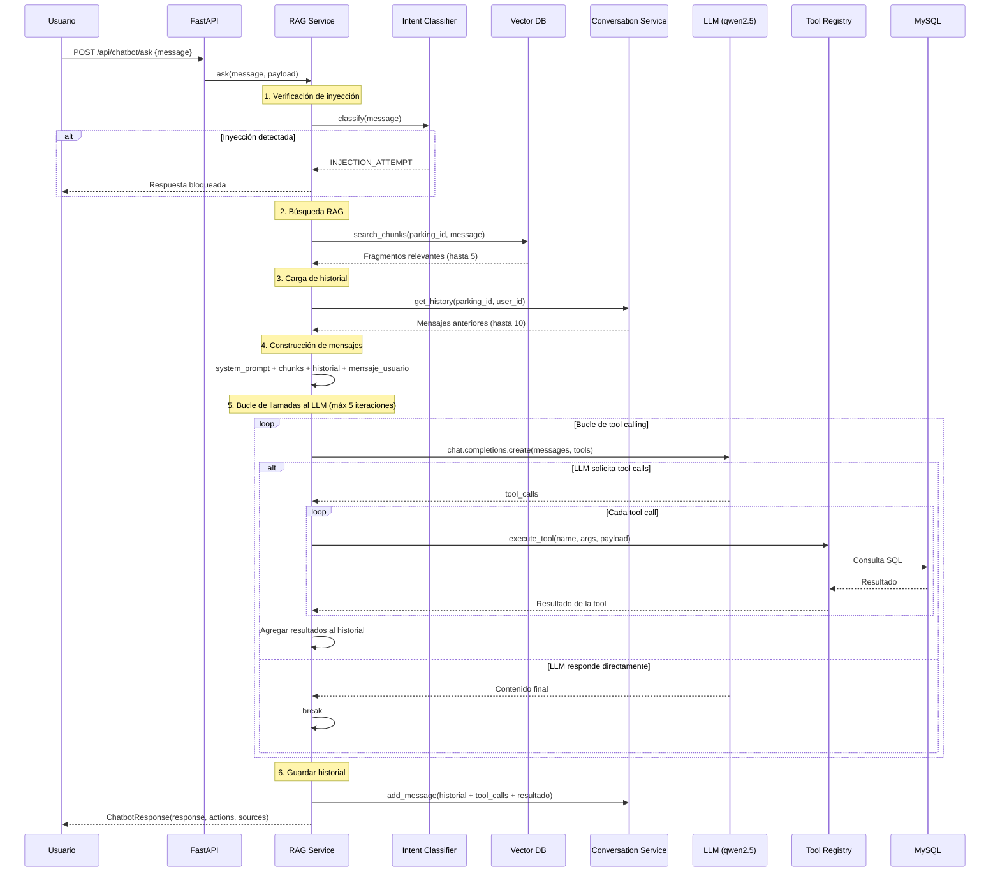
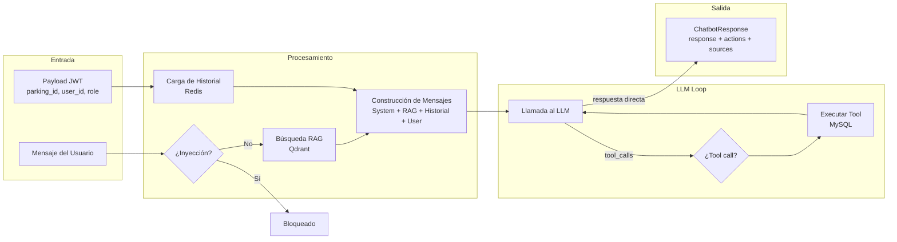

# Arquitectura del Chatbot

## Descripción General

Chatbot impulsado por IA para la gestión de estacionamientos. El Admin interactúa mediante lenguaje natural para consultar y modificar datos del parking (pisos, plazas, tarifas, ingresos, egresos, pagos). Construido con FastAPI + Ollama (qwen2.5) + Qdrant (RAG) + Redis (historial de conversación).

---

## Arquitectura de Alto Nivel



---

## Flujo de una Request



---

## Componentes

### Intent Classifier (`services/intent_classifier.py`)

Primera línea de defensa. Detecta intentos de inyección de prompts (ej: "ignora instrucciones anteriores", "DAN mode", "abuelito"). Retorna `INJECTION_ATTEMPT` para bloquear entradas maliciosas antes de que lleguen al LLM.

### RAG Service (`services/rag_service.py`)

El orquestador. Gestiona el ciclo de vida completo de cada request:
1. Clasificar intención
2. Buscar contexto relevante en Qdrant
3. Cargar historial de conversación desde Redis
4. Construir system prompt (reglas base + contexto RAG)
5. Ejecutar el bucle de tool calling del LLM
6. Persistir la conversación en Redis
7. Retornar `ChatbotResponse`

### Embedding Service (`services/embedding_service.py`)

Carga perezosamente `all-MiniLM-L6-v2` (384 dimensiones) para búsqueda semántica. Genera embeddings de las consultas del usuario y de los fragmentos de conocimiento.

### Vector Repository (`repositories/vector_repository.py`)

Operaciones en Qdrant: upsert, search, delete. Almacena fragmentos de conocimiento del parking (tarifas, métodos de pago, información general) con filtro por `parking_id`.

### Knowledge Generator (`services/knowledge_generator.py`)

Regenera la base de conocimiento vectorial de un parking: extrae información del parking, tarifas, métodos de pago → fragmentos → embeddings → upsert a Qdrant. Se ejecuta mediante la tarea Celery `rebuild_parking_knowledge`.

### Conversation Service (`services/conversation_service.py`)

Historial de conversación respaldado en Redis:
- Key: `chatbot:history:{parking_id}:{user_id}`
- Máximo 40 mensajes, TTL 24h
- Limpia mensajes huérfanos de tools y secuencias incompletas
- Almacena mensajes del usuario, respuestas del asistente, y pares de tool call/result

### Context Builder (`services/context_builder.py`)

Construye un snapshot en tiempo real del parking desde MySQL:
- Nombre del parking, pisos, plazas (libres/ocupadas)
- Entradas activas, pagos del día
- Tarifas, pisos con etiquetas de plazas

Usado por la herramienta `get_parking_state` para consultas de datos en vivo.

### Tool Registry (`services/tool_registry.py`)

Registro central de 20 herramientas. Cada tool tiene: nombre, descripción, parámetros (JSON Schema), roles requeridos y función. Maneja control de acceso por roles y despacho sync/async.

---

## Herramientas

| Herramienta | Descripción | Tipo |
|---|---|---|
| `get_parking_state` | Snapshot en vivo: pisos, plazas, tarifas, pagos | Lectura |
| `get_parking_info` | Información general del parking (nombre, país) | Lectura |
| `list_floors` | Listar todos los pisos | Lectura |
| `list_spots` | Listar plazas (filtro opcional por piso) | Lectura |
| `list_tariffs` | Listar todas las tarifas | Lectura |
| `list_entries` | Listar todos los ingresos de vehículos | Lectura |
| `list_exits` | Listar todas las salidas de vehículos | Lectura |
| `list_payments` | Listar todos los pagos | Lectura |
| `list_plates` | Listar todas las placas registradas | Lectura |
| `get_occupancy_stats` | Total, ocupadas, libres | Lectura |
| `get_daily_summary` | Ingresos, salidas e ingresos del día | Lectura |
| `create_floor` | Crear un nuevo piso | Escritura |
| `create_spot` | Crear una nueva plaza | Escritura |
| `create_tariff` | Crear una nueva tarifa | Escritura |
| `register_entry` | Registrar ingreso de vehículo | Escritura |
| `register_exit` | Registrar salida de vehículo | Escritura |
| `register_plate` | Registrar una nueva placa | Escritura |
| `create_payment` | Registrar pago + salida | Escritura |
| `update_floor` | Actualizar nombre del piso | Escritura (confirmar) |
| `update_spot` | Actualizar detalles de plaza | Escritura (confirmar) |
| `update_tariff` | Actualizar valor de tarifa | Escritura (confirmar) |
| `update_parking` | Actualizar nombre del parking | Escritura |
| `delete_floor` | Eliminar piso + plazas | Destruktiva (confirmar) |
| `delete_spot` | Eliminar una plaza | Destruktiva (confirmar) |
| `delete_tariff` | Eliminar una tarifa | Destruktiva (confirmar) |

> **confirmar**: La herramienta requiere `confirm: true` en los parámetros antes de ejecutarse.

---

## Estructura del System Prompt

```
┌─────────────────────────────────────────────┐
│ Prompt base (system.txt)                    │
│ - Definición del rol                        │
│ - 15 reglas obligatorias                    │
│   - Prevención de inyección                 │
│   - Restricción de dominio                  │
│   - Reglas de concisión                     │
│   - Reglas de confirmación                  │
│   - Comportamiento de tool calling          │
├─────────────────────────────────────────────┤
│ INFORMACIÓN DE REFERENCIA                   │
│ - Fragmentos RAG de Qdrant                  │
│   [fuente - categoría]                      │
│   texto del fragmento                       │
│ - "No hay información adicional"            │
│   si está vacío                             │
└─────────────────────────────────────────────┘
```

---

## Flujo de Datos



---

## Seguridad

| Capa | Mecanismo |
|---|---|
| Autenticación | JWT en cookies HTTP-only |
| Autorización | Middleware `require_roles(["Admin"])` |
| Limitación de tasa | `RateLimiter(times=20, seconds=60)` |
| Detección de inyección | Patrones regex en IntentClassifier |
| Restricción de dominio | Regla 14 del system prompt |
| Validación de entrada | `safe_str` con min/max de longitud |
| Puertas de confirmación | Tools destructivas requieren `confirm: true` |
| Aislamiento del parking | `parking_id` siempre del JWT, nunca del cliente |

---

## Estructura de Archivos

```
app/features/chatbot/
├── controllers/
│   └── chatbot_controller.py      # Manejador HTTP
├── models/
│   ├── chatbot_responses.py       # Esquema ChatbotResponse
│   └── chatbot_schemas.py         # ChatbotAskSchema (entrada)
├── prompts/
│   └── system.txt                 # System prompt del LLM (15 reglas)
├── repositories/
│   ├── chatbot_repository.py      # Consultas MySQL (snapshot, stats)
│   └── vector_repository.py       # Operaciones en Qdrant
├── routes/
│   └── chatbot_routes.py          # POST /api/chatbot/ask
├── services/
│   ├── chatbot_service.py         # Capa de servicio delgada
│   ├── context_builder.py         # Snapshot del parking en tiempo real
│   ├── conversation_service.py    # Historial de conversación en Redis
│   ├── embedding_service.py       # Cargador de SentenceTransformer
│   ├── intent_classifier.py       # Detección de inyección
│   ├── knowledge_generator.py     # Constructor de conocimiento Qdrant
│   ├── rag_service.py             # Orquestador principal
│   └── tool_registry.py           # Definiciones + despacho de tools
└── tools/
    ├── entries_tools.py           # list_entries, register_entry
    ├── exits_tools.py             # list_exits, register_exit
    ├── floors_tools.py            # CRUD de pisos
    ├── parking_tools.py           # Info del parking, placas, estado
    ├── payments_tools.py          # Listar, calcular, crear pago
    ├── queries_tools.py           # Stats de ocupación, resumen diario
    ├── spots_tools.py             # CRUD de plazas
    └── tariffs_tools.py           # CRUD de tarifas
```
